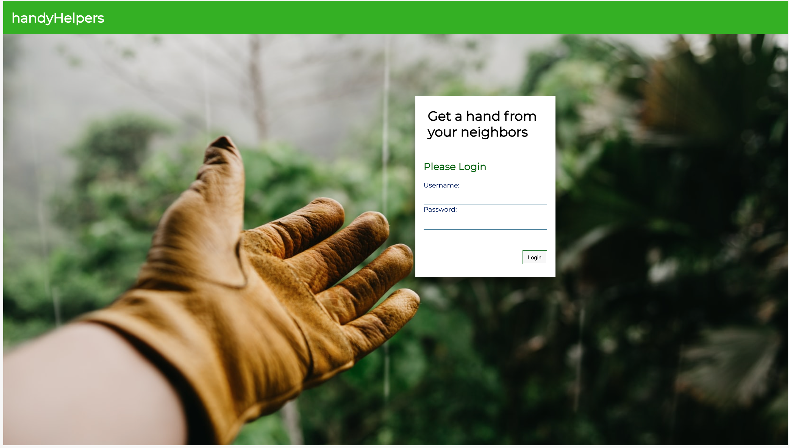
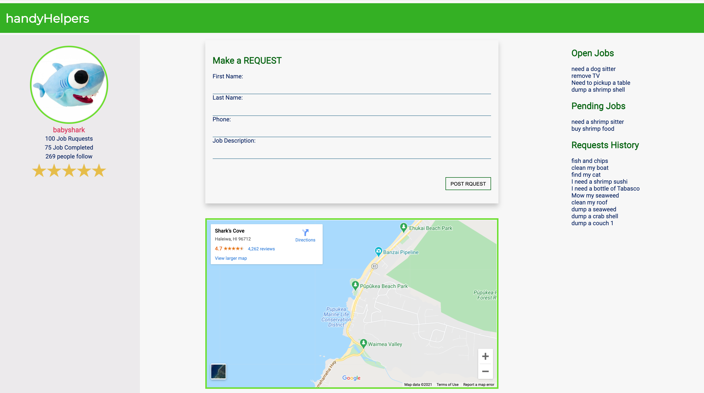

# handyHelpers

# Introduction
I was inspired by the conversations that always happen within Fackbook groups that people are asking for help on small jobs, for example, ask for help to remove a couch or mow a small lawn, etc.
This application allows users to create profiles, then post and accept jobs from people with the community.

I built a database using postgreSQL to store user information and job information. Everything information displayed on the application will be automatically retrieved from the database based on your account information.

In the frontend, I had a login page for users to sign in. a profile page to display user information including the number of jobs they posted and completed. There are also a request job form, job list, map and rating associated with it.

# Tech stack
<ul>
<li>React(with hooks)</li>
<li>Webpack/Babel</li>
<li>Express</li>
<li>Axios</li>
<li>NodeJS</li>
<li>CSS</li>
</ul>

# Technical Challenges and Research
Some unexpected challenges included:

<ul>
<li>Building the authentication system</li>
<li>Dynamically rendering job list from database</li>
</ul>

# User Stories
<ul>
<li>As a user, I should be able to login my account</li>
<li>As a user, I should be able to see my profile</li>
<li>As a user, I expect to see open jobs that I can take</li>
<li>As a user, I should be able to make a job request</li>
<li>As a user, I should be able to see pending jobs</li>
<li>As a user, I should be able to see my request history</li>
</ul>

# How does the app work?
<h2>login page:</h2>

<h2>Profile:</h2>

